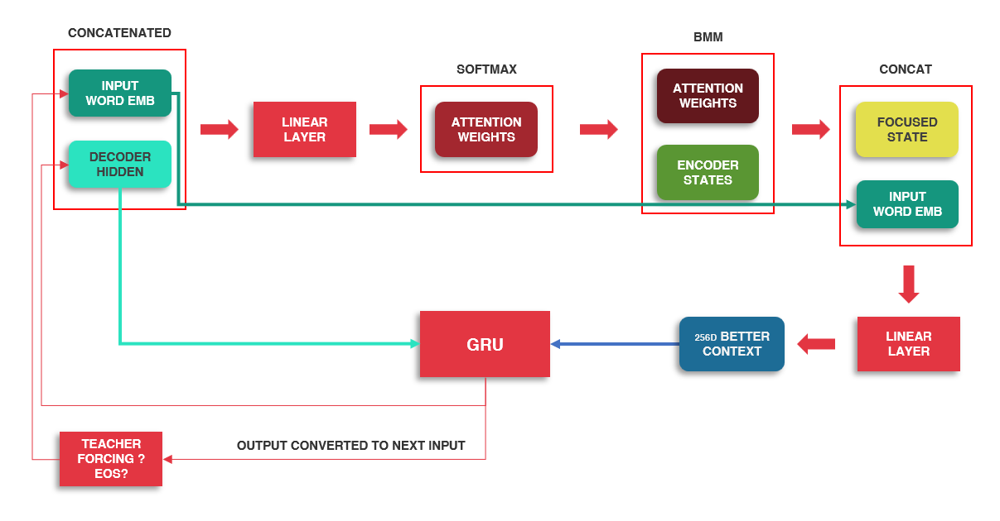

# Sequence to Sequence using LSTM + Attention

Task: French -> English Translation (*one sequence to another*)

## Network 
We use a simple Encoder-Decoder structure, both Encoder & Decoder being a `LSTM` with `1 layer`.
Input is fed to an Embedding layer, embedding dim is kept as `256`
Each sentence has `10` words at max.

## Attention Mechanism

Attention comes from the insight that as humans, given an information and a task to be performed, we selectively deem some part of the information as more important than the rest.
This importance keeps shifting based on our need.

For example, assume a classroom of students being taught History, Geography, and Maths, by the same teacher.
It's quite possible that some students are better in History, than in the other subjects, some are better in Maths, and so on.
While teaching History, the teacher might focus more on students are who are weak in History.
Similarly, for the same set of students, the teacher might focus more on a different group while teaching Geography or Maths.

This selective/relative importance is what we hope to achieve in our model as well, using Attention Mechanisms.

Extending the analogy further, we can call the set of students as `Keys`, the subject being taught as `Query`, and the relative strength/weakness of each student, for that subject/`Query`, as the `Values`. 


## Code Walkthrough




We use the custom method of Attention, where we calculate the Attention weights on `Input Word Embeddings` + `Decoder's Hidden State`

### Encoder

```
input_size = input_lang.n_words
hidden_size = 256
encoder_embedding = nn.Embedding(input_size, hidden_size).to(device)
encoder_lstm = nn.LSTM(hidden_size, hidden_size, num_layers=1).to(device)

encoder_outputs = torch.zeros(MAX_LENGTH, 256, device=device)
encoder_hidden = (
    torch.zeros(1, 1, 256).to(device),
    torch.zeros(1, 1, 256).to(device)
) # hidden state, cell state

for i in range(input_tensor.size()[0]):
  embedded_input = encoder_embedding(input_tensor[i].view(-1, 1))
  output, encoder_hidden = encoder_lstm(embedded_input, encoder_hidden)
  encoder_outputs[i] += output[0,0]
```

1. We form the embedding layer based on number of unique input words. Embedding size used: `256`
2. We form the Encoder layer as a LSTM, input, hidden size as `256`, total layers: `1`
3. We form our output array - size of `10,256` - `max len, output size`
4. The initial hidden input of the encoder is all zeros. It's a tuple containing `hidden state`, `cell state`
5. We iterate through each input inside our input tensor, call the encoder layer, and add the output to our output array

```
> encoder_outputs.shape, encoder_hidden[0].shape, encoder_hidden[1].shape
(torch.Size([10, 256]), torch.Size([1, 1, 256]), torch.Size([1, 1, 256]))
```

### Decodeer

```
decoded_words = []

output_size = output_lang.n_words
decoder_embedding = nn.Embedding(output_size, 256).to(device)
attn_weight_layer = nn.Linear(256*2, MAX_LENGTH).to(device)
input_to_decoder_lstm_layer = nn.Linear(256 * 2, 256).to(device)
decoder_lstm = nn.LSTM(256, 256).to(device)
output_word_layer = nn.Linear(256, output_lang.n_words).to(device)

# these will be overwritten below, used for input to the decoder
decoder_hidden = None
top_index = None

# running decoder twice, no teacher forcing
for i in range(2):
  if i == 0:
    decoder_input = torch.tensor([[SOS_token]], device=device)
    decoder_hidden = encoder_hidden
  else:
    decoder_input = torch.tensor([[top_index.item()]], device=device)

  embedded_output = decoder_embedding(decoder_input)
  attn_weights = attn_weight_layer(torch.cat((embedded_output[0], decoder_hidden[0][0]), 1))
  attn_weights = F.softmax(attn_weights, dim=1)
  attn_applied = torch.bmm(attn_weights.unsqueeze(0), encoder_outputs.unsqueeze(0))
  
  input_to_decoder_lstm = input_to_decoder_lstm_layer(torch.cat((embedded_output[0], attn_applied[0]), 1))
  input_to_decoder_lstm = input_to_decoder_lstm.unsqueeze(0)

  output, decoder_hidden = decoder_lstm(input_to_decoder_lstm, decoder_hidden)
  output = F.relu(output)
  output = F.softmax(output_word_layer(output[0]), dim = 1)

  top_value, top_index = output.data.topk(1)
  decoded_word = output_lang.index2word[top_index.item()]
  decoded_words.append(decoded_word)

print(decoded_words)
```

1. We create our embedding layer based on number of words in output & embedding size: `256`
2. We have an attention layer, which will take the embedding output + decoder's hidden state output.
3. We have another layer to take the attention weights & convert it to the size the Decoder can take: `512 -> 256`
4. The decoder is a LSTM layer. Input, hidden size as `256`, total layers: `1`
5. The LSTM's output is fed to the output linear layer, to get our final word
6. We iterate twice, to show only 2 output words
   1. If it's the 1st instance, the input to the decoder is `SOS` token, hiddens state is last encoder's hidden state.
   2. Otherwise, the decoder's input is previous decoder's output. In this example, we aren't doing teacher forcing, so target index is not fed.
   3. We get the embedding layer's output
   4. We get the attention weights using `embedding output` + `hidden state`. Since `decoder_hidden` is a tuple containing `hidden` + `cell` state, we take the 1st element - the `hidden` state.
   5. Softmax is applied to get the relative importance
   6. The attention weights are then applied to the `encoder_outputs`, to weigh the current input.
   7. We feed this to another linear layer, to get `512 -> 256`, same shape as what the decoder expects
   8. Decoder is fed the attention applied inputs, and the current hidden state
   9. We apply `Relu` activation on decoder's output, feed it into a linear layer + Softmax to get the final values
   10. The top index of the softmax result is the translated word we want.